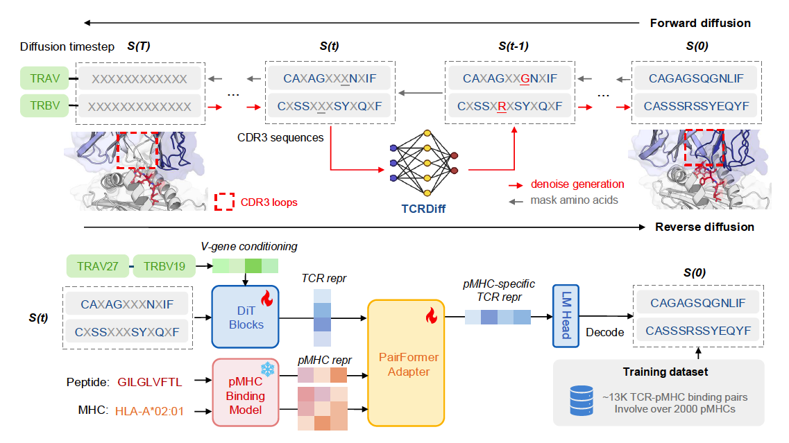

## TCRDiff: a conditional diffusion model for designing antigen-specific TCR CDR3

<!-- This repository contains the source code for the preprint paper []() -->

TCRDiff generates antigen-specific TCRs conditioned on peptide-MHC targets and germline-encoded V-genes via the denoising diffusion process. It was pre-trained on large T-cell repertoires and TCR-pMHC recognition datasets. The generated CDR3 sequences exhibited superior consistency with natural binding TCRs and structural plausibility of the designed TCR-pMHC complexes.



### Installation

1. Clone the repository

   ```python
   git clone https://github.com/zhangyumeng1sjtu/TCRDiff.git
   cd TCRDiff/
   ```
2. Create a virtual environment by conda

   ```python
   conda create -n tcrdiff_env python=3.12.2
   conda activate tcrdiff_env
   ```
3. Download PyTorch>=2.4.1, which is compatible with your CUDA version and other Python packages

   ```python
   conda install pytorch==2.4.1 pytorch-cuda=12.4 -c pytorch -c nvidia
   pip install -r requirements.txt
   ```

### Download data and model checkpoints

The following data and model checkpoints are available at [Zenodo](https://doi.org/10.5281/zenodo.20586708).

- `data/pep`: pre-trained peptide sequences.
- `data/pmhc`: pre-trained peptide-MHC binding data and MHC sequences.
- `data/tcr`: pre-trained TCRs in T-cell repertoires.
- `data/tcrpmhc`: TCR-pMHC recognition dataset.

- `logs/tcr-pmhc-binding-subsample-2/`: checkponits of TCRDiff binding predictor.
- `logs/tcr-pmhc-cond-dplm-cross-attn-finetune-tcr-dplm-all-constant/`: checkponits of TCRDiff generative model.

### Usage

#### Design antigen-specific TCR

- Condaitional generation of CDR3 sequences 

    ```bash
    python scripts/generate/generate_pmhc_binding_tcr.py \
        --config logs/tcr-pmhc-cond-dplm-cross-attn-finetune-tcr-dplm-all-constant/config.yml \
        --num_seqs <num_generated_seq> \ # e.g., 1000
        --alpha_seq_len <cdr3_alpha_len> \ # e.g., 15
        --beta_seq_len <cdr3_beta_len> \ # e.g., 13
        --peptide <peptide_seq> \ # e.g., EVDPIGHLY
        --mhc <mhc> \ # e.g.m HLA-A\*01:01
        --mhca <mhc_alpha> \ # e.g., A\*01:01
        --mhcb <mhc_beta> \ # e.g., b2m
        --trav <trav_gene> \ # e.g., TRAV21\*01
        --trbv <trbv_gene> \ # e.g., TRBV5-1\*01
        --organism <oragnism> \ # human or mouse
        --temperature <sampling_temperature> \ # e.g., 0.1
        --sampling_strategy gumbel_argmax \
        --max_iter <sampling_itermations> \ # e.g., 10
        --gpu_device <gpu_device_num> \
        --saveto <output_path>
    ```

- Preprare inputs for binding prediction of the generated TCRs

    Refer to `scripts/design/prepare_binding_inputs.py`, use your peptide-MHC (Optional: off-target peptide), V-gene, and generated outputs instead.

- Predict binding rank percentiles to filter TCR designs

    Refer to `scripts/design/predict_binding.sh`, use your customized binding prediction inputs instead.


#### Train TCRDiff from scratch

- Pre-train peptide language model and peptide-MHC binding model

    ```bash
    python scripts/pretrain/pretrain_peptide_lm.py --config configs/config-pretrain-peptide-lm.yml
    python scripts/train/train_pmhc_model.py --config configs/config-train-pmhc-model.yml
    ```

- Pre-train TCR diffusion language model

    ```bash
    python scripts/pretrain/pretrain_tcr_lm.py --config configs/config-pretrain-tcr-lm.yml
    python scripts/pretrain/pretrain_tcr_dplm.py --config configs/config-pretrain-tcr-dplm.yml
    ```

- Train TCR-pMHC binding predictor

    ```bash
    python scripts/train/train_tcr_pmhc_model.py --config configs/config-train-tcr-pmhc-model.yml
    ```

- Train conditional TCR diffusion model (TCRDiff)

    ```bash
    python scripts/train/train_tcr_pmhc_cond_dplm.py --config configs/config-train-tcr-pmhc-dplm.yml
    ```

<!-- ### Citation -->

### Contact

If you have any questions, please contact us at [yumeng.zhang1@monash.edu](mailto:yumeng.zhang1@monash.edu) or [jiangning.song@monash.edu](mailto:jiangning.song@monash.edu).
